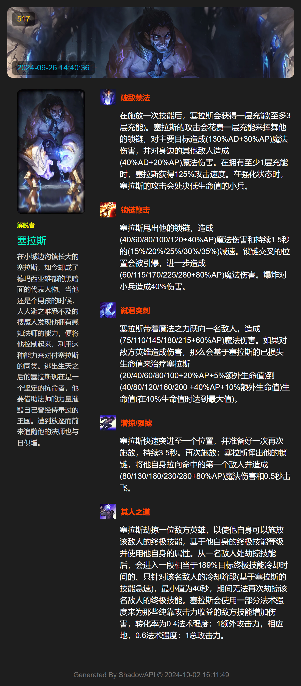
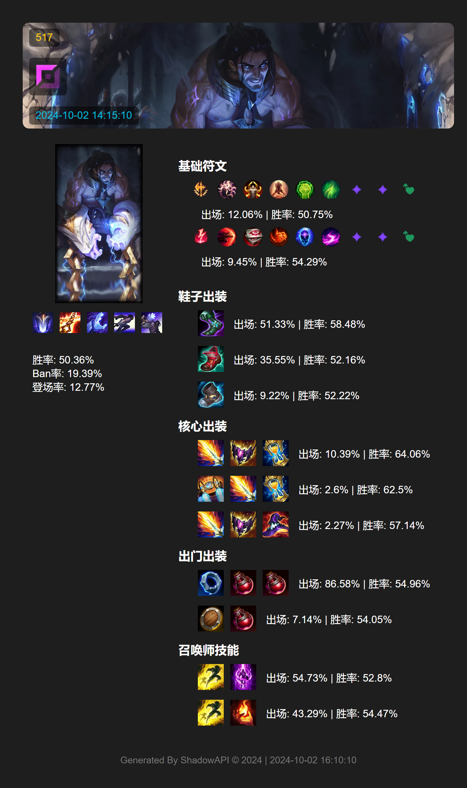

<div align="center">

<a href="https://v2.nonebot.dev/store">
  
</a>

<p>
  
</p>

# nonebot-plugin-lolinfo

_✨ 基于 [NoneBot2](https://github.com/nonebot/nonebot2) & [ShadowAPI](https://api-dev.shadow403.cn/) 的一个 NoneBot 英雄联盟查询插件 ✨_


<a href="./LICENSE">
  
</a>
<a href="https://pypi.python.org/pypi/nonebot_plugin_lolinfo">
  
</a>

</div>

## 📖 介绍
将英雄联盟的各种信息发送到QQ中 持续更新中 🚧

## 🎞 效果

`/hinfo 塞拉斯`


`/rinfo 塞拉斯 上`


## 💿 安装
```pip
pip install nonebot-plugin-lolinfo
```

```nb
nb plugin install nonebot-plugin-lolinfo
```

## 🎁 使用
`Tips:  支持模糊搜索 🔍`
- /hinfo `<英雄名 | 英雄外号>`
- /rinfo `<英雄名 | 英雄外号>` `<分路>`


## ❤ 感谢
- 图片制作 [`nonebot-plugin-htmlrender`](https://github.com/kexue-z/nonebot-plugin-htmlrender)

<br>

<details>
<summary> 日志 </summary>

`v0.1.0` 发布此项目

`v0.1.1` 修改 README.md

`v0.2.0` 整体更新 本地合成图片

`v0.2.1` 更新依赖

`v0.2.1` 更新 PluginConfig
